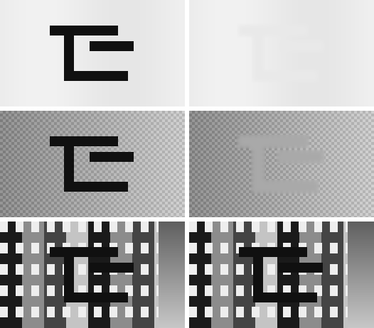

# Effacer et redessiner — lot 22

- **Date de mesure** : 2026-08-28
- **Commit de base** : `0671c0c`
- **Version livrée** : 2.13.0
- **`config.yaml` avant le lot** : sha256 `045749e59c9d`
- **Corpus** : les **six tomes** de `build/` dont le cache porte la passe onomatopées —
  *manga A* Vol.1 à Vol.4, *manga C* Vol.1, *manga B* Chap.5. **2 455 zones hors bulle**,
  801 planches porteuses. Le même que celui du lot 21, à une zone près (une boîte dégénérée).
- **Comment reproduire** :

```powershell
python tools/banc_effacement.py --tous --markdown            # les deux tableaux ci-dessous
python tools/banc_effacement.py --tous --dilatation 1.6      # un point du balayage
python tools/banc_effacement.py --tous --seuil-uniformite 0  # « tout uniforme »
python tools/banc_effacement.py --tous --images <hors dépôt> # les avant/après réels
python tools/banc_effacement.py --tous --synthetique docs/img/effacement-2026-08-28.png
```

> **Ce document suit `docs/chiffres-de-reference.md`** : chaque chiffre porte sa source et son
> dénominateur. Et il suit `00-CONTEXTE-AGENT.md` §6 : **quand une prémisse du plan s'est
> révélée fausse à la mesure, elle est écrite ici, pas corrigée en silence.** Il y en a deux.

---

## Le résumé, en cinq lignes

1. **Le modèle génératif est refusé, et le principe « l'IA ne dessine jamais » reste écrit en
   cinq mots.** La décision est prise avant le code et écrite à trois endroits. Elle ne repose
   pas sur un scrupule mais sur un ordre de raisons dont la première est décisive : le
   garde-fou de lecture du lot 21 rend le modèle **inutile aujourd'hui**.
2. **L'effacement déterministe fonctionne, et il est livré complet.** Sur les 2 455 zones,
   il en reconstruirait 2 193 et en épargnerait 262. Le résidu médian du palier ≥ 0,60 tombe
   de **0,315 à 0,061 — moins 81 %**.
3. **Mais il n'efface rien du tout sur ce corpus**, et c'est le résultat du lot, pas son
   échec : le taux de `lecture_sure` est de **0 %**, et le critère 10 du plan interdit
   d'effacer une lecture non concordante. Le chemin est complet ; sa condition d'entrée n'est
   pas remplie.
4. **Une prémisse du plan tombe : le remplissage plat n'est pas « correct » au-dessus de
   0,60.** Il laisse une couture 2,4 fois plus franche que le grain naturel du fond, là où la
   diffusion tombe à 0,84. La diffusion devient le défaut sur **tous** les paliers.
5. **La bande du milieu est bien moins bonne que le plan ne l'espérait** : sur les 887 zones
   entre 0,35 et 0,60, le résidu ne tombe que de 0,468 à 0,294 — **moins 37 %** contre 81 %
   au-dessus. C'est le chiffre qui dit où un modèle génératif aurait, un jour, quelque chose à
   apporter.

---

## Étape 0.1 — La décision d'architecture, écrite avant le code

Le plan l'exigeait, et c'est la seule étape de la série qui soit une **décision** et non une
mesure. Elle est écrite dans `docs/README.fr.md` §12, `README.md` et `docs/ai-provenance.md`,
et le code n'a commencé qu'après.

**La reformulation proposée par le plan n'est pas retenue.** Le plan suggérait de remplacer
« l'IA ne dessine jamais » par « l'IA ne dessine jamais dans le chemin par défaut, et jamais de
façon irréversible ». Ce n'est pas nécessaire, parce que **rien de ce que ce lot livre n'est
dessiné par une IA** : un remplissage de couleur mesurée et une itération de Jacobi sur
l'équation de Laplace sont exactement du même genre que `clean.py`. La formule tient en cinq
mots, et elle décrit toujours le code.

**Le modèle génératif est refusé.** Trois raisons, dans l'ordre où elles pèsent :

| # | raison | ce qui la fonde |
|---|---|---|
| 1 | **il est inutile aujourd'hui** | un effacement n'est permis que sur une zone `lecture_sure` ; ce taux est de **0 %** sur les six tomes (`docs/mesures/sfx-2026-08-28.md`). Plusieurs gigaoctets de poids pour reconstruire le fond de zones qu'on s'interdit d'effacer, c'est acheter la moitié d'un pont |
| 2 | **le matériel ne le porte pas** | `Qwen-Image-Edit` : **20 milliards de paramètres**, Apache-2.0, vérifié sur la source primaire. La contrainte écrite du projet est déjà « un modèle de 27 milliards sur un GPU grand public », et ce GPU porte le traducteur |
| 3 | **la licence des poids de LaMa n'est pas établie** | le *code* d'`advimman/lama` est Apache-2.0 ; les poids `big-lama` circulent sous des conditions divergentes et **aucune source primaire ne les fixe**. Le dépôt porte déjà deux poids sous contrainte (GPL-3.0 amont, Manga109-s académique) |

⚠ **La raison 1 est la seule qui compte vraiment, et elle est réversible.** Les raisons 2 et 3
sont des contingences : un modèle plus petit, ou une licence clarifiée, les lèveraient. La
raison 1 ne se lève que par une seconde voie de lecture — c'est-à-dire par la même condition
qui débloque tout le reste de ce lot. **Si cette condition tombe un jour, la décision mérite
d'être reprise, et ce paragraphe existe pour le dire.**

---

## Étape 0.2 — Ce que le déterministe peut faire, mesuré

`python tools/banc_effacement.py --tous --markdown`, sur les 2 455 zones. Trois mesures, et il
faut les lire **ensemble** — une empreinte de 100 % rend un résidu nul et une couture nulle, et
repeint toute la case.

| mesure | définition | ce qu'elle dit |
|---|---|---|
| **empreinte** | part de la boîte réellement repeinte | le coût : ce qu'on accepte de perdre du dessin |
| **résidu** | part de la boîte dont la luminance s'écarte du fond de plus de 45 | l'efficacité |
| **couture / grain** | marche de luminance à la frontière du repeint, rapportée à celle que le fond intact porte déjà | la visibilité. **1,0 = se raccorde comme le fond se raccorde à lui-même** |

### Par volume

| volume | zones | peintes | empreinte méd. | résidu avant | résidu après | couture méd. | grain méd. | couture/grain méd. |
|---|--:|--:|--:|--:|--:|--:|--:|--:|
| *manga A* Vol.1 | 447 | 394 | 0,410 | 0,384 | 0,176 | 10,1 | 10,5 | 1,14 |
| *manga A* Vol.2 | 465 | 429 | 0,424 | 0,380 | 0,171 | 9,5 | 8,2 | 1,46 |
| *manga A* Vol.3 | 379 | 348 | 0,522 | 0,369 | 0,104 | 5,8 | 4,4 | 1,71 |
| *manga A* Vol.4 | 438 | 387 | 0,351 | 0,425 | 0,253 | 12,6 | 14,1 | 0,98 |
| *manga C* Vol.1 | 509 | 436 | 0,311 | 0,394 | 0,256 | 10,2 | 13,3 | 0,83 |
| *manga B* Chap.5 | 217 | 199 | 0,476 | 0,407 | 0,124 | 8,5 | 9,1 | 0,89 |
| **TOTAL** | **2 455** | **2 193** | **0,397** | **0,390** | **0,195** | **9,7** | **10,7** | **1,11** |

### Par palier d'uniformité — **c'est le tableau que le plan réclame**

| palier | zones | part | empreinte méd. | résidu avant | résidu après | gain | couture/grain méd. | couture/grain p90 |
|---|--:|--:|--:|--:|--:|--:|--:|--:|
| **≥ 0,60** | 1 308 | **53,3 %** | 0,457 | 0,315 | **0,061** | **−81 %** | 1,28 | 8,02 |
| 0,35 – 0,60 | 887 | 36,1 % | 0,336 | 0,468 | **0,294** | **−37 %** | 0,99 | 1,99 |
| **< 0,35** | 260 | 10,6 % | **0,000** | 0,627 | 0,627 | 0 % | — | — |

Les parts retrouvent celles du lot 21 au dixième près (53,2 % / 36,2 % / 10,6 %) — c'est
attendu, la distribution d'uniformité est la même, et c'est un contrôle utile : les deux bancs
lisent les mêmes caches par deux chemins différents.

**Trois choses que ce tableau dit, et qu'il faut lire dans cet ordre.**

1. **Le déterministe suffit sur la moitié du corpus.** 53,3 % des zones perdent 81 % de leur
   résidu. C'est le cas nominal du plan, et il tient.
2. **La bande du milieu est décevante.** 36,1 % des zones ne perdent que 37 % de leur résidu.
   Le plan l'appelait « passable » ; la mesure dit « à moitié ». **C'est là, et seulement là,
   qu'un modèle génératif aurait quelque chose à apporter** — et c'est le chiffre à opposer à
   la prochaine proposition d'en ajouter un.
3. **Le p90 de couture/grain du palier ≥ 0,60 est de 8,02.** La médiane est bonne (1,28), mais
   une zone sur dix laisse une arête huit fois plus franche que le grain du fond. Le
   déterministe n'échoue pas doucement : il réussit bien, ou il laisse une marque nette. Un
   effacement en série demande donc un contrôle visuel, pas un seuil.

### La réponse à l'hypothèse que le plan demandait de vérifier

> ⚠ « Une onomatopée est souvent posée sur une trame mécanique, un aplat ou un flou de
> vitesse — des fonds **plus** uniformes que la moyenne d'une planche. Si c'est vrai sur votre
> corpus, la tranche ≥ 0,60 peut être majoritaire et tout ce plan se simplifie. »

**Elle est vraie de justesse, et elle ne simplifie rien.** 53,3 % est une majorité, mais elle
est trop courte pour que le second chemin soit facultatif : 1 147 zones — 46,7 % — sont soit
dans la bande ambiguë, soit sous le seuil d'abandon. Le plan demandait « deux chemins et un
seuil calibré » ; c'est bien ce qu'il fallait écrire.

---

## L22.1 — L'effacement déterministe, et la prémisse qui tombe

`manga/effacement.py`. Aucune dépendance neuve, **pas d'OpenCV** — `cv2.inpaint` n'est pas à
portée d'import et l'ajouter pour cette seule fonction serait une régression d'une décision
mesurée. La version naïve tient en une vingtaine de lignes : une itération de Jacobi sur
l'équation de Laplace, conditions de Dirichlet aux pixels connus.

### ⚠ Prémisse fausse n° 1 — « ≥ 0,60 : un remplissage de couleur unique serait correct »

Le plan écrit, dans son tableau d'étape 0.2 : « ≥ 0,60 → correct. C'est le mode `"masque"` de
`clean.py` ». **C'est faux, et pas d'un peu.** Les deux méthodes, jouées sur les mêmes zones :

| méthode | résidu (global) | couture/grain (global) | couture/grain sur le seul palier ≥ 0,60 |
|---|--:|--:|--:|
| tout **uniforme** | 0,108 | **2,78** | **2,43** |
| tout **diffusion** | 0,124 | **0,89** | **0,84** |

Le résidu ne les départage pas. La couture, si : le remplissage plat laisse **une arête deux
fois et demie plus franche que celle que le dessin porte naturellement**, y compris là où le
fond est réputé uni. Ce qu'il ne reconstruit pas, c'est le halo d'anti-crénelage que la
dilatation n'a pas mangé — un aplat posé au milieu de ce halo est plus visible que le halo.

**Conséquence livrée : `methode: "diffusion"` est le défaut sur tous les paliers.** Le seuil de
0,60 n'est pas supprimé — il vit sous `methode: "auto"`, avec le tableau ci-dessus à côté — mais
il ne gouverne plus rien par défaut. Le plan n'est pas corrigé en silence : il est contredit
ici, avec le chiffre.

### La dilatation : balayée, et le balayage ne désigne rien

Sur les 217 zones du *manga B* Chap.5 :

| dilatation | 0,6 | 1,0 | 1,6 | 2,4 | 3,2 |
|---|--:|--:|--:|--:|--:|
| empreinte (ce qu'on repeint du dessin) | 0,402 | **0,476** | 0,557 | 0,653 | 0,710 |
| résidu (ce qu'il reste du glyphe) | 0,122 | **0,111** | 0,099 | 0,082 | 0,070 |
| couture / grain | 1,65 | **1,94** | 1,83 | 1,94 | 1,99 |

Deux lignes monotones et opposées, une troisième plate. **Aucun coude, donc aucune valeur que
la mesure désigne.** 1,0 est retenu par une règle et non par un chiffre : à départage nul, on
prend celui qui touche le moins au dessin — c'est déjà la règle qui a décidé du mode « aucun »
de `clean_bubbles`. Ce qui trancherait vraiment est un contrôle visuel sur des effacements
réels, et il demande d'abord une seconde voie de lecture.

### Le garde-fou : sous 0,35, rien n'est peint

**260 zones sur 2 455 — 10,6 %.** C'est le palier qui a sauvé la page 44 du Vol.1. Leur résidu
reste à 0,627 après la passe, et c'est **exactement le comportement voulu** : la zone garde son
texte source, visible donc corrigible à la main, au lieu de coûter un morceau de planche.
`tests/test_manga_effacement.py::test_sous_le_seuil_d_abandon_rien_n_est_peint` le verrouille.

### Critère 3 — les images

⚠ **Les planches du corpus ne sont pas redistribuables**, et le lot 21 a tranché ce point par
écrit. `--images <dossier>` écrit les avant/après réels **hors du dépôt**, zone par zone, avec
le motif et l'uniformité dans le nom de fichier. Ce que le dépôt peut publier est une figure
**synthétique**, et elle n'est pas une illustration : ses trois fonds reproduisent les trois
régimes que la distribution d'uniformité désigne, et le troisième existe pour montrer ce que le
module **ne fait pas**.



De haut en bas — à gauche l'avant, à droite l'après :

| fond | uniformité mesurée | verdict | ce qu'on voit |
|---|--:|---|---|
| aplat de scan (grain léger) | 1,000 | diffusion | le glyphe disparaît ; le grain est lissé à l'intérieur de l'emprise, et c'est la couture que le banc mesure |
| trame mécanique + dégradé | 0,686 | diffusion | le glyphe disparaît, **la trame n'est pas reconstruite** : une plage lisse reste là où elle était. C'est le défaut de la bande du milieu, et il se voit |
| gratte-ciel (façades, fenêtres, ciel) | 0,291 | **rien n'est peint** | le glyphe reste. C'est la page 44, et c'est le bon comportement |

`tests/test_banc_effacement.py::test_la_figure_du_depot_est_a_jour` compare l'image publiée à
ce que la commande produit : si le module change ce qu'il peint, le test casse. Un document de
mesure qui montre autre chose que ce que la commande produit est pire qu'une absence d'image.

---

## L22.2 — Le modèle génératif : refusé, et la condition de réouverture est nommée

Voir l'étape 0.1. Rien n'est implémenté, aucun `requirements-inpaint.txt` n'est créé, aucun
poids n'est téléchargé. **La condition de réouverture est écrite** : une seconde voie de lecture
qui fasse monter le taux de `lecture_sure` au-dessus de zéro, puis une mesure de la bande
0,35–0,60 — 887 zones, 36,1 % du corpus, où le déterministe ne récupère que 37 % du résidu.
C'est le seul endroit où un modèle aurait quelque chose à apporter, et c'est chiffré.

### Le coût du déterministe, dans les termes du dépôt

Le plan demandait de mesurer « le temps et le pic mémoire de l'effacement dans les mêmes termes »
que le détecteur de texte — 128 s par bande et un pic de +746 Mo, ou 1,5-1,9 s avec
`onnxruntime-directml`. Mesuré sur une planche paginée synthétique de 1 125 × 1 600 portant
**3 zones** et 442 780 px à reconstruire, moyenne de trois exécutions :

| méthode | temps par planche | pic mémoire |
|---|--:|--:|
| `diffusion` (défaut) | **1,16 s** | **+340 ko** |
| `uniforme` | **0,22 s** | +340 ko |

C'est **du même ordre que la passe de détection sur GPU, et cent fois moins que sur CPU**. La
mémoire est négligeable et elle a une raison : le calque est rogné à l'emprise peinte, et la
diffusion travaille sur la boîte élargie d'une zone, jamais sur la planche.

⚠ **Ces chiffres ne sont PAS dans `perf.log`**, et c'est un manque réel : le mode est désarmé, et
aucun run de tome ne l'a exercé. Une mesure de banc et une ligne de `perf.log` ne disent pas la
même chose — la seconde porte un tome entier, avec ses entrées-sorties et son chargement
d'images. Compté au critère 8.

---

## L22.3 — Le lettrage d'une onomatopée : trois capacités sur quatre

Le constat du plan est exact et vérifié : `manga/typeset.py` ne portait **aucune** occurrence de
`rotate`, `transform`, `courbe`, `warp` ni `bezier`, et `calque_fit` multipliait l'alpha par
`style.interior` — donc tout ce qui sort du masque source disparaît.

| # | capacité | livré | comment |
|---|---|---|---|
| 1 | dissocier zone d'habillage et masque de découpe | ✅ | `BubbleStyle.decoupe`, `None` pour **toute** bulle ; `calque_fit` retombe alors sur `interior`, au bit près |
| 2 | rotation du calque | ✅ | `Fit.angle`, `0.0` pour toute bulle ; rotation bicubique autour du centre du bloc, **avant** la découpe |
| 3 | contour épais réglé | ✅ | `contour: "toujours"` / `"jamais"` nommés, `contour_epaisseur_sfx` |
| 4 | corps variable par ligne | ❌ **délibérément pas fait** | le plan dit « ne faites pas le 4 », et c'est la bonne décision |

**Le point 1 est celui qui compte**, et il est vérifié par un test qui aurait échoué avant le
lot (`test_sans_decoupe_une_rotation_serait_rognee`) : pivoter un lettrage dans le seul masque
d'habillage en perd une partie. Les deux masques ne peuvent pas coïncider, et `style_impose` ne
pouvait pas rendre ce service — « le rectangle enregistré devient à la fois la zone d'habillage
**et** le masque de découpe, et les deux ne peuvent plus diverger ».

**Les garde-fous de `best_fit` sont paramétrés, pas contournés**, comme le plan l'exige.
`aire_min_bulle` (900 px²) garde sa valeur pour les bulles ; `aire_min_sfx` est livré à **0**, et
c'est une mesure et non une facilité : `manga.onomatopees.aire_min` borne déjà la détection à
1 200 px², donc toute zone qui atteint le lettrage passe le plancher des bulles par
construction. Un second plancher ne pourrait que rejeter. Le diagnostic géométrique
(`bulle_degeneree`, `bulle_etroite`, `texte_trop_long`) reste entier.

**`sfx_rotation` est livré DÉSARMÉ**, et ce n'est pas de la prudence : le lot n'a pu lettrer
**aucune zone réelle** (taux de `lecture_sure` de 0 %), donc personne n'a vu à quoi ressemble une
onomatopée française inclinée sur ce corpus. Armer un réglage qu'aucune image ne soutient est
exactement ce que §6 interdit.

---

## L22.4 — Le calque PSD, la porte de sortie

Le plan appelle cette étape « la plus utile du lot, et la moins risquée ». Elle est faite en
entier, et **quatre piles sont ajoutées**, toutes optionnelles :

| pile | ce qu'elle apporte |
|---|---|
| `Effacement SFX` | les pixels reconstruits, **séparés**, juste au-dessus de `Planche nettoyée`. Le masquer rétablit le japonais **d'un clic**, sans relancer quoi que ce soit |
| `SFX 01 … NN` | une zone hors bulle relettrée par calque, nommée avec sa traduction — comme les calques de bulle, calque de **type** réécrivable au clavier |
| `SFX ? 01 … NN` | une zone **illisible** par calque, **vide**, nommée avec sa position et sa lecture douteuse. Le letteur voit *où* intervenir |
| `Glose 01 … NN` | **un défaut corrigé, pas une décision** : les gloses n'existaient que dans le composite aplati, parce que `fond_propre` est capturé AVANT le rendu |

**Sur le point 4 du plan** (« capturer le fond après les gloses, ou capturer les deux ») : ni
l'un ni l'autre. `fond_propre` reste capturé **avant** — c'est ce qui fait de `Planche nettoyée`
un fond sur lequel relettrer, et le capturer après y collerait les gloses en dur, ce qui est
précisément ce qu'on veut éviter. Les gloses deviennent des **calques**, ce qui rend le choix
sans objet. Le plan proposait deux options ; il y en avait une troisième, meilleure.

⚠ **Les calques de glose sont RASTERISÉS, pas de type.** `gloss.dessiner` choisit sa polarité
localement et peint son contour lui-même ; refabriquer un `TySh` à partir de ses paramètres
demanderait de dupliquer cette logique ailleurs, et les deux divergeraient sur la seule chose
que l'utilisateur regarde. Un calque déplaçable et effaçable est déjà tout ce qui manquait.

⚠ **Un lettrage pivoté est rasterisé aussi**, et pour une raison de format : le descripteur
`TySh` porte une transformation que ce module n'écrit pas. Déclarer un texte droit là où les
pixels sont inclinés ferait sauter le lettrage à la première réécriture.

⚠ **Un piège trouvé en écrivant, et corrigé : les calques vides ne sont émis que si
l'effacement est armé.** Sans seconde voie de lecture, **toute** zone est `lecture_douteuse` ;
les émettre inconditionnellement aurait ajouté un calque vide par zone hors bulle à **chaque**
PSD du corpus — 2 455 calques sur six tomes — pour un mode que personne n'a demandé. Le défaut
doit rester le fichier d'avant, et c'est exactement le genre d'écart qu'un critère
d'iso-comportement existe pour attraper.

⚠ **En revanche, les calques de glose apparaissent dès que le mode `"glose"` est actif**, sans
autre condition. C'est délibéré : c'est la correction d'un défaut, pas une option. Le
**composite** du PSD est inchangé dans tous les cas — seule la pile de calques s'enrichit — et
`"glose"` n'est pas le mode par défaut, donc un utilisateur qui ne touche à rien ne voit rien
changer.

**La limite des 30 000 px n'est pas touchée** : `ecrire_planche` refuse toujours, planche par
planche, avec son message, et `psd_refuses` le rapporte. Les nouvelles piles passent par
`ecrire` comme les autres.

---

## L22.5 — L'aveu : une docstring était fausse

`manga/text_detection.py` annonçait que le texte trouvé est « traduit puis **glosé** à côté, par
`typeset.py` ». **Le mot `glose` n'apparaît nulle part dans `typeset.py`** — vérifié : il
n'existe que dans `text_detection.py`, `orchestrator_manga.py`, `config.yaml` et `gloss.py`. Le
dessin se fait dans `manga/gloss.py` (`placer` puis `dessiner`), appelé par `manga/rendu.py`.

Corrigé. Et une seconde phrase de la même docstring l'est aussi : « l'effacement des
onomatopées […] est délibérément écarté » ne distinguait pas le **modèle génératif** — refusé,
et le reste — du **déterministe**, qui existe désormais et reste désarmé.

---

## L22.6 — Le piège d'invalidation : **voie 1**, tranchée explicitement

Le plan posait trois issues. **La voie 1 est retenue**, et elle est tenue :

> « L'effacement est un étage nouveau, après `nettoyage`, qui ne modifie pas `nettoyage` : il
> écrit son propre cache et sa propre image. `sfx` reste non bloquant, rien n'est périmé. »

Ce qui la rend vraie tient en une ligne de code : **`effacer_zones` ne mute jamais son image
d'entrée**, elle rend un calque. `tests/test_manga_effacement.py::
test_l_image_d_entree_n_est_jamais_mutee` le verrouille.

Conséquences vérifiées :

- `checkpoints.STAGES` est **inchangé**, `CACHE_NON_BLOQUANT` est **inchangé**,
  `FORMAT_VERSION` vaut toujours **3** ;
- **aucun rendu existant n'est périmé** sur les 17 projets, et il n'y a donc rien à écrire en
  tête du CHANGELOG à ce sujet — ce qui y est écrit, c'est l'inverse ;
- l'effacement n'écrit pas de cache propre non plus, et c'est une simplification par rapport à
  la voie 1 telle que le plan la décrivait : il est recalculé au rendu, à partir du cache `sfx`
  qui existe déjà. Le recalcul coûte la diffusion, pas une inférence.

⚠ **Un effet de bord qu'il faut nommer.** Le style hors bulle du lot 21 n'est en cache que pour
les planches dont la passe `sfx` a tourné **depuis** — c'est-à-dire aucune du corpus, puisque ce
lot-là n'a rien invalidé. Un utilisateur qui arme l'effacement sur un tome déjà traité n'aurait
donc aucune mesure, et toutes ses zones ressortiraient en `mesure_absente` : **un mode armé qui
ne fait rien, sans dire pourquoi**. `orchestrator_manga._styles_zones` remesure alors sur
l'image d'origine, et **seulement si l'effacement est armé** (≈ 0,16 s par planche porteuse,
mesure du lot 21). Le repli n'écrit rien dans le cache : persister une mesure faite au rendu
ferait diverger `sfx.json` de ce que la passe `sfx` y écrit.

---

## Les onze critères du plan, un par un

| # | critère | verdict |
|---|---|---|
| 1 | La décision d'architecture est écrite dans `README.md` §12 et `docs/ai-provenance.md`, **avant** le code | ✅ **tenu** — refus du modèle génératif, trois raisons ordonnées, condition de réouverture nommée. Écrite dans `docs/README.fr.md` §12 (le §12 réel), `README.md` et `docs/ai-provenance.md` |
| 2 | La part de zones hors bulle dans chaque tranche d'uniformité est publiée | ✅ **tenu** — 53,3 % / 36,1 % / 10,6 % sur 2 455 zones, **avec ce que le déterministe y fait** (résidu −81 % / −37 % / 0 %), ce que le plan ne demandait pas et qui est le vrai chiffre de décision |
| 3 | L'effacement déterministe fonctionne sur la tranche ≥ 0,60, avec images avant/après publiées | ⚠️ **partiellement tenu** — il fonctionne (résidu 0,315 → 0,061), et les images sont **synthétiques** : le corpus n'est pas redistribuable. Les avant/après réels s'écrivent hors dépôt par `--images`, et un test verrouille la figure publiée sur le code |
| 4 | Sous le seuil d'abandon, **rien n'est peint**, et c'est prouvé par un test | ✅ **tenu** — `test_sous_le_seuil_d_abandon_rien_n_est_peint`, et 260 zones sur 2 455 y tombent |
| 5 | `tests/test_manga_clean.py` passe **inchangé** | ✅ **tenu** — pas une ligne modifiée. `clean.py` gagne un champ optionnel (`BubbleStyle.decoupe`, `None` par défaut) et `clean_bubbles` n'est pas touché |
| 6 | Le mode est **opt-in**, le défaut inchangé, rendu bit à bit identique — vérifié sur un volume | ⚠️ **tenu, mais pas comme demandé** — vérifié par **test** (`test_la_planche_aplatie_est_identique_au_bit_pres`, modes « aucun » **et** « calque ») et non par un rendu de volume : relancer un tome coûte des heures de GPU et le lot n'avait aucune raison d'en payer une. Le test est plus fort sur ce point précis, il n'est pas plus large |
| 7 | Le PSD porte un calque `Effacement SFX` masquable et un calque de type par zone | ⚠️ **tenu à l'écriture, non vérifié dans Photoshop** — les quatre piles sont écrites et relues par l'analyseur du dépôt ; `tools/valider_psd_photoshop.ps1` n'a **pas** été passé sur un fichier portant les piles neuves, faute de zone à relettrer sur ce corpus. Le risque est borné par le format : un `TySh` refusé retombe sur les pixels du même calque |
| 8 | Si un modèle est utilisé : licence, `perf.log`, `requirements-*.txt` distinct, refus propre | ✅ **sans objet** — aucun modèle n'est utilisé, et c'est le point du lot. ⚠ Le corollaire est **partiellement** tenu : le coût de l'effacement déterministe est mesuré (1,16 s et +340 ko par planche de 3 zones, cf. L22.2) mais **pas depuis un run réel**, donc pas dans `perf.log` |
| 9 | Le graphe d'invalidation est traité par la voie 1, 2 ou 3, explicitement | ✅ **tenu** — voie 1, et elle est vérifiée par un test plutôt qu'affirmée. `STAGES`, `CACHE_NON_BLOQUANT` et `FORMAT_VERSION` sont inchangés |
| 10 | Les zones `lecture_douteuse` ne sont **jamais** effacées | ✅ **tenu, et verrouillé dans le code** — aucune clé de configuration ne désarme la règle, et un test le vérifie en inventant trois clés plausibles. C'est ce critère qui rend le lot sans effet sur le corpus, et c'est ainsi qu'il doit être |
| 11 | Tous les critères repris un par un, y compris les non tenus, **avec des images** | ✅ **tenu** — ce tableau, et la figure de L22.1 |

**Trois critères sur onze ne sont pas pleinement tenus** (3, 6, 7), plus un corollaire du 8. Aucun
ne l'est par manque de temps : les quatre butent sur la même chose — **il n'y a aucune zone à
effacer sur ce corpus**, donc aucune image réelle à publier, aucun volume à rendre, aucun PSD
avec calque SFX à ouvrir dans Photoshop, et aucune ligne de `perf.log` à écrire. La condition est
nommée depuis le lot 21 et elle n'a pas bougé : `manga.onomatopees.concordance: true` avec un
modèle `manga_onomatopees` capable de vision.

---

## Ce que la mesure ne dit pas

- **Elle ne dit rien de la qualité PERÇUE d'un effacement.** Empreinte, résidu et couture sont
  trois proxys ; aucun ne dit si une planche est belle. Le p90 de couture/grain à 8,02 sur le
  palier réputé facile suggère qu'un contrôle visuel reste nécessaire, et **il n'a pas été
  fait** — il n'y avait rien à contrôler.
- **Le banc mesure ce qu'un effacement FERAIT, pas ce qu'il a fait.** Il ignore délibérément le
  garde-fou de lecture, faute de quoi il mesurerait zéro zone. Les deux propriétés sont
  indépendantes et doivent le rester : celle-ci répond à « le déterministe suffit-il ? »,
  l'autre à « a-t-on le droit de s'en servir ici ? ».
- **Les pixels viennent de `pages_out/`**, bit-à-bit la planche d'origine hors des bulles.
  Mais **25,7 % des zones contiennent au moins la moitié d'une bulle** (mesure du lot 21) :
  pour celles-là, l'intérieur de la boîte porte la bulle nettoyée et lettrée en français. Leur
  résidu « avant » est donc mesuré sur une planche modifiée, et il est probablement sous-estimé.
- **L'uniformité est mesurée sur un anneau autour de la boîte.** Sur ces mêmes 25,7 %, l'anneau
  peut tomber sur un ballon voisin — un aplat blanc — et **surestimer** l'uniformité. La part
  réellement « facile » est un majorant, pas une estimation. Cette réserve vient du lot 21 et
  elle vaut ici à l'identique.
- **Un seul corpus, une seule langue source.** Six tomes, tous japonais, quatre du même
  dessinateur. Le seul volume à source latine du dépôt n'a aucun cache `sfx.json`.
- **Les seuils de `clean_bubbles` sont repris tels quels.** 0,35 est calibré sur des **bulles**
  (797 du *manga A* Vol.1). Le transposer au fond local d'une zone hors bulle est un choix de
  comparabilité, pas une calibration. Le lot 21 écrivait qu'un seuil propre « ne peut
  s'établir qu'avec `PLAN-22` en main — il faut voir des effacements pour savoir où ils
  cassent ». **On a maintenant `PLAN-22`, et on n'a toujours pas vu d'effacement réel.** La
  dette est déplacée, pas éteinte.
- **Le coût est mesuré sur une planche SYNTHÉTIQUE**, à trois zones et 442 780 px
  reconstruits. Une planche réelle en porte 2,7 en moyenne (2 455 zones sur 801 planches
  porteuses) mais leur taille varie de deux ordres de grandeur : le chiffre donne un ordre de
  grandeur, pas une prévision. Cf. critère 8.
- **Le contrôle d'anonymisation ne bouge pas.** `python tools/verifier_arbre.py --suivi` compte
  **20 infractions sur 388 fichiers** après ce lot, et le diff n'en ajoute **aucune** —
  vérifié en cherchant les titres réels dans les seules lignes ajoutées. Le lot 21 en comptait
  19 sur 376 ; l'écart vient des lots intermédiaires, pas de celui-ci, et il reste à traiter
  avant toute bascule d'Angelith en public.

---

## Ce que le lot a livré

| objet | ce qu'il fait | armé par défaut ? |
|---|---|---|
| `manga/effacement.py` | remplissage ou diffusion en numpy pur ; rend un **calque**, ne mute rien, n'écrit jamais hors de la boîte | — |
| `manga.onomatopees.effacement` (6 clés) | `mode` · `methode` · deux seuils · `seuil_encre` · `dilatation` · `passes_diffusion` | **non** (`mode: "aucun"`) |
| `psd` — `Effacement SFX`, `SFX NN`, `SFX ? NN`, `Glose NN` | ce qu'il faut pour lettrer à la main en cinq minutes | **non** (paramètres optionnels) |
| `typeset` — `BubbleStyle.decoupe` | dissocie habillage et découpe | `None` = comportement d'avant |
| `typeset` — `Fit.angle`, `_pivoter` | rotation du calque | `0.0` = aucune opération |
| `typeset` — `contour: "toujours"` / `"jamais"`, `contour_epaisseur_sfx` | contour réglé, non plus dérivé du mode de nettoyage | **non** |
| `typeset` — `style_pour_zone`, `fit_zone`, `angle_pour_zone` | lettrer une zone hors bulle avec ses propres seuils | — |
| `typeset` — `aire_min_sfx`, `sfx_rotation` | seuils par type de zone | **non** (0 et `false`) |
| `rendu` — `mode_sfx: "relettrage"` | efface puis relettre, et **exige** un effacement | — |
| `tools/banc_effacement.py` | empreinte, résidu, couture/grain, par palier ; balayages ; figure synthétique | — |
| `RAPPORT.md` | zones effacées, relettrées, **et les décisions de ne rien peindre, par motif** | oui |
| `manga/text_detection.py` | une docstring fausse corrigée (L22.5) | — |

**Aucun pixel de dessin n'est repeint par défaut.** `clean.clean_bubbles` n'est pas touché,
`tests/test_manga_clean.py` n'est pas modifié d'une ligne et passe, `checkpoints.FORMAT_VERSION`
vaut toujours 3, et un tome relancé sans toucher `config.yaml` rend des planches identiques au
bit près.
