# Le système visuel — lot 19, 2026-08-27

> **Ce que ce document publie** — le relevé de l'existant, la décision de l'étape 0, le tableau
> de contraste des deux thèmes, les captures avant/après, **et ce que la mesure ne dit pas**.
> Les neuf critères du `PLAN-19` sont repris un par un à la fin, y compris ceux qui ne sont pas
> tenus.
>
> **Provenance** — commit de départ `ad5f6f0`, version publiée 2.9.0, `config.yaml`
> SHA-256 `d971be6abb9f87610c993dd0a23e1a0b043211b4f3d01d5520db12f4a70566e5`. Le lot ne touche
> pas `config.yaml` : la seule clé ajoutée vit dans `.angelith/interface.json`.
>
> **Nature** — MINEUR. Aucun cache invalidé, aucune clé de configuration supprimée, aucun
> chemin de pipeline modifié. `manga/checkpoints.py:FORMAT_VERSION` est intact.

---

## 1. Étape 0 — le relevé, et ce qu'il a trouvé de plus que le plan

Le `PLAN-19` annonçait **vingt** occurrences de couleur littérale, **quatre** `setStyleSheet`
et **trois** tailles de police. Le relevé fait au 2026-08-27, après la livraison du lot 18
(2.9.0, la coquille applicative), en trouve davantage :

| Ce que le plan annonçait | Ce que le relevé trouve | Écart |
|---|---|---|
| 20 couleurs littérales | **26** | +6 |
| 4 `setStyleSheet` | **12** | +8 |
| 3 tailles de police | **6** (5 en `px`, 1 en `pt`) | +3 |
| 4 fichiers touchés | **5** (`dialogues.py` s'ajoute) | +1 |

> ⚠ **La prémisse du plan était juste, son chiffre ne l'était plus.** Le plan a été écrit avant
> le lot 18 ; celui-ci a ajouté six couleurs et huit feuilles inline en trois semaines. C'est
> précisément la démonstration de son propre argument : sans point de définition commun **et
> sans test**, un système de design se dilue à la vitesse où le logiciel grandit. Le chiffre
> qui compte n'est donc pas 20 ni 26, c'est le taux — **+30 % en un lot**.

### 1.1 Les 26 couleurs, une par une

| Fichier:ligne | Valeur | Ce qu'elle peint |
|---|---|---|
| `dialogues.py:90` | `#9aa` | poids des sources, boîte « Nouveau projet » |
| `dialogues.py:132` | `#d05030` | message d'erreur de la boîte |
| `dialogues.py:454` | `#9aa` | note des préférences |
| `editeur.py:283` | `#9aa` | ligne d'état sous la barre d'outils |
| `editeur.py:286` | `#d09030` | bandeau « affichage seul » |
| `editeur.py:351` | `#9aa` | astuce du glisser-déposer de l'accueil |
| `editeur.py:828` | `#e9e9ec` | aplat d'attente d'une vignette |
| `fenetre.py:182` | `#d09030` | « travail non enregistré » de la barre haute |
| `fenetre.py:198` | `#7aa` | avancement du préchargement |
| `fenetre.py:62` | `QColor(220,150,40)` | journal · avertissement |
| `fenetre.py:62` | `QColor(120,170,220)` | journal · verbose |
| `fenetre.py:63` | `QColor(150,200,150)` | journal · étape |
| `fenetre.py:63` | `QColor(210,210,210)` | journal · info |
| `pellicule.py:170` | `#d05030` | pastille « brouillon non écrit » |
| `pellicule.py:172` | `#777` | pastille « jamais détectée » |
| `pellicule.py:174` | `#d09030` | pastille « rendu périmé » |
| `pellicule.py:176` | `#6aa6d8` | pastille « repris à la main » |
| `scene_planche.py:56` | `QColor(70,150,255)` | cadre d'une zone |
| `scene_planche.py:57` | `QColor(255,170,40)` | zone sélectionnée |
| `scene_planche.py:58` | `QColor(230,80,80)` | bulle sans réplique |
| `scene_planche.py:59` | `QColor(120,210,120)` | réplique reprise à la main |
| `scene_planche.py:60` | `QColor(255,255,255)` | tracé en cours |
| `scene_planche.py:189` | `QColor(30,30,34)` | contour d'une poignée |
| `scene_planche.py:424` | `QColor(20,20,20)` | numéro d'ordre de lecture |
| `scene_planche.py:433` | `QColor(255,210,90,230)` | pastille du numéro |
| `scene_planche.py:714` | `QColor(40,40,44)` | fond du canevas |

⚠ **Les trois dernières de `scene_planche.py` sont celles que le relevé initial du plan avait
manquées.** Elles ne sont pas exotiques : ce sont le contour des poignées, le numéro d'ordre de
lecture — « l'information la plus utile de tout l'écran », dit sa propre docstring — et son
fond. Un inventaire à la main manque trois valeurs sur vingt-trois ; c'est l'argument du
critère 8.

### 1.2 Les six tailles de police

| Fichier:ligne | Valeur | Ce qu'elle règle |
|---|---|---|
| `dialogues.py:90`, `:127`, `:454`, `editeur.py:283`, `:351`, `fenetre.py:223` | `font-size: 11px` | six libellés secondaires et le journal |
| `dialogues.py:270` | `font-size: 12px` | panneau de texte des diagnostics |
| `editeur.py:319` | `font-size: 20px` | titre de l'état vide |
| `scene_planche.py:426` | `setPointSizeF(16)` | numéro d'ordre de lecture |

Et une famille : `font-family: Consolas, monospace`, trois fois. **`Consolas` est une police
Windows** ; le repli générique sauvait la mise mais rien de nommé ne le précédait.

### 1.3 Les valeurs d'espacement et de dimension codées en dur

Vingt-six sites, dont : taille de fenêtre (`1520×960`), marges de layouts (`6`, `4`, `10/4/10/10`,
`0`), largeurs minimales (`240`, `220`, `160`), tailles de splitters (`[240, 860, 380]`,
`[940, 0]`), hauteurs maximales de champs (`70`, `90`, `120`, `150`), grille de la pellicule
(`200`, `300`, `212`, `344`, espacement `6`), côté des poignées (`11.0`), seuil de tracé (`6`).

> ⚠ **Toutes n'ont pas été normalisées, et c'est délibéré.** Cf. §6.2.

### 1.4 L'accessibilité, avant

| Mesure | Avant |
|---|---|
| `setAccessibleName` | **0** |
| `setTabOrder` | **0** |
| `setFocusPolicy` | **0** |
| `setWhatsThis` | **0** |
| Infobulles | 29 |
| Alternative clavier aux gestes de canevas | **aucune** |

---

## 2. Le défaut qui se voyait à l'œil nu, mesuré

Le plan l'énonçait : les gris `#9aa`, `#7aa` et le `#d2d2d2` du journal sont des valeurs de
**thème sombre**, appliquées sur des widgets que le style natif de Windows peint en **blanc**.
Le calcul le confirme, et il est pire que ce que la prose laissait entendre.

**Contraste de l'existant, mesuré (WCAG 2.1) :**

| Ce que c'était | Valeur | Sur | Cible | Rapport | Verdict |
|---|---|---|---|---|---|
| ligne d'état, astuces, notes | `#9aa` | `#ffffff` | 4,5:1 | **2,42** | non tenu |
| avancement du préchargement | `#7aa` | `#f0f0f0` | 4,5:1 | **2,27** | non tenu |
| journal · info | `#d2d2d2` | `#ffffff` | 4,5:1 | **1,51** | non tenu |
| journal · avertissement | `#dc9628` | `#ffffff` | 4,5:1 | **2,49** | non tenu |
| journal · verbose | `#78aadc` | `#ffffff` | 4,5:1 | **2,45** | non tenu |
| journal · étape | `#96c896` | `#ffffff` | 4,5:1 | **1,91** | non tenu |
| travail non écrit / rendu périmé | `#d09030` | `#ffffff` | 4,5:1 | **2,72** | non tenu |
| pastille « repris à la main » | `#6aa6d8` | `#ffffff` | 4,5:1 | **2,61** | non tenu |
| pastille « jamais détectée » | `#777` | `#ffffff` | 4,5:1 | **4,48** | non tenu |
| brouillon non écrit / erreur | `#d05030` | `#ffffff` | 4,5:1 | **4,31** | non tenu |
| aplat d'attente de vignette | `#e9e9ec` | `#ffffff` | 3,0:1 | **1,21** | non tenu |

**Onze sur onze.** Le pire est `info`, à **1,51:1** — c'est-à-dire illisible — et c'est le
niveau de journal **le plus fréquent** : c'est lui qui porte « N planche(s) enregistrée(s) »,
la confirmation qu'un travail est allé sur le disque.

Deux cas méritent d'être nommés parce qu'ils passent presque :

- **`#777` à 4,48:1** rate la cible de 0,02. Une couleur choisie à l'œil peut être juste à
  1 % près et fausse quand même — c'est exactement pourquoi le plan disait « vérifiez le
  contraste, ne l'estimez pas ».
- **`#e9e9ec` à 1,21:1** est l'aplat d'attente d'une vignette, dont la docstring affirmait
  qu'il donnait « cette lecture d'un coup d'œil ». Il était invisible. La docstring décrivait
  une intention, pas un pixel.

---

## 3. La décision de l'étape 0 : clair **et** sombre, canevas toujours sombre

**Trois surfaces, pas deux.**

| Surface | Suit le thème ? | Pourquoi |
|---|---|---|
| `chrome` — menus, panneaux, formulaires, listes | **oui** | un formulaire illisible n'a aucune excuse |
| `canevas` — le fond derrière la planche | **non, toujours sombre** | convention de tous les outils d'image : ne pas éblouir, faire ressortir le dessin. `QColor(40,40,44)` l'appliquait déjà, et il avait raison |
| `journal` | oui, mais en monospace et à quatre niveaux distinguables | c'est ce qu'on relit après un incident |

Le mode par défaut est **`auto`** : l'interface suit ce que le système annonce
(`QStyleHints.colorScheme()`), avec repli sur le clair. C'est le seul défaut iso-perception —
jusqu'ici l'application portait le style natif de la plateforme, donc clair sur une machine
réglée en clair. Un `"clair"` en dur aurait fait **pire** que le lot 18 sur une machine réglée
en sombre.

Neuf rôles ne changent pas d'un thème à l'autre (`theme.ROLES_CANEVAS`), et
`test_le_canevas_ne_change_pas_avec_le_theme` le vérifie : une décision écrite dans un plan et
non vérifiée dérive.

---

## 4. Le tableau de contraste des deux thèmes livrés

**Cibles : 4,5:1 pour le texte courant, 3:1 pour les gros textes, les bordures et les états.**
Trente-cinq paires, deux thèmes, **soixante-dix mesures, zéro échec**. Le tableau est produit
par `theme.tableau_contraste()` et vérifié par `test_toutes_les_paires_tiennent_leur_cible`.

**Chrome — texte et surfaces**

| Élément | Sur | Cible | Clair | Sombre |
|---|---|---|---|---|
| `texte` | `fond` | 4.5:1 | **16.29** | **13.85** |
| `texte` | `fond_eleve` | 4.5:1 | **18.04** | **11.89** |
| `texte_faible` | `fond` | 4.5:1 | **6.65** | **7.15** |
| `texte_faible` | `fond_eleve` | 4.5:1 | **7.37** | **6.14** |
| `texte` | `lecture_seule_fond` | 4.5:1 | **15.30** | **13.02** |
| `accent` | `fond` | 4.5:1 | **5.95** | **6.38** |
| `accent_texte` | `accent` | 4.5:1 | **6.59** | **7.09** |
| `selection_texte` | `selection` | 4.5:1 | **6.59** | **5.30** |
| `desactive_texte` | `desactive_fond` | 3.0:1 | **4.28** | **4.41** |
| `desactive_texte` | `fond` | 3.0:1 | **4.76** | **4.87** |
| `bordure` | `fond` | 3.0:1 | **3.04** | **3.66** |
| `bordure` | `fond_eleve` | 3.0:1 | **3.37** | **3.14** |
| `focus` | `fond` | 3.0:1 | **5.95** | **7.66** |
| `focus` | `fond_eleve` | 3.0:1 | **6.59** | **6.58** |

**États — messages et journal**

| Élément | Sur | Cible | Clair | Sombre |
|---|---|---|---|---|
| `avertissement` | `fond` | 4.5:1 | **6.03** | **8.01** |
| `avertissement` | `fond_eleve` | 4.5:1 | **6.68** | **6.87** |
| `erreur` | `fond` | 4.5:1 | **6.70** | **6.16** |
| `erreur` | `fond_eleve` | 4.5:1 | **7.43** | **5.29** |
| `succes` | `fond` | 4.5:1 | **6.03** | **8.49** |
| `succes` | `fond_eleve` | 4.5:1 | **6.68** | **7.29** |
| `information` | `fond` | 4.5:1 | **10.15** | **11.02** |
| `information` | `fond_eleve` | 4.5:1 | **11.24** | **9.46** |
| `modifie` | `fond` | 4.5:1 | **6.03** | **8.01** |

**Pellicule**

| Élément | Sur | Cible | Clair | Sombre |
|---|---|---|---|---|
| `pastille_perimee` | `fond_eleve` | 4.5:1 | **6.68** | **6.87** |
| `pastille_main` | `fond_eleve` | 4.5:1 | **7.19** | **5.47** |
| `pastille_absente` | `fond_eleve` | 4.5:1 | **5.94** | **5.13** |
| `pastille_brouillon` | `fond_eleve` | 4.5:1 | **7.43** | **5.29** |
| `vignette_attente` | `fond_eleve` | 3.0:1 | **3.20** | **3.37** |

**Canevas — identique dans les deux thèmes**

| Élément | Sur | Cible | Clair | Sombre |
|---|---|---|---|---|
| `zone` | `canevas_fond` | 3.0:1 | **4.94** | **4.94** |
| `zone_choisie` | `canevas_fond` | 3.0:1 | **7.71** | **7.71** |
| `zone_vide` | `canevas_fond` | 3.0:1 | **3.94** | **3.94** |
| `zone_main` | `canevas_fond` | 3.0:1 | **7.89** | **7.89** |
| `zone_trace` | `canevas_fond` | 3.0:1 | **14.68** | **14.68** |
| `numero_texte` | `numero_fond` | 4.5:1 | **12.82** | **12.82** |
| `poignee_contour` | `zone_choisie` | 3.0:1 | **8.73** | **8.73** |

### 4.1 Trois couleurs ont dû changer pour tenir la cible

Le plan disait : « si une couleur d'état ne peut pas atteindre 3:1 sur les deux fonds, changez
la couleur, pas la cible ». Trois l'ont fait.

| Rôle | Premier choix | Rapport | Livré | Rapport |
|---|---|---|---|---|
| `bordure` (clair) | `#b9b9c4` | 1,76 | `#8b8b96` | **3,04** |
| `bordure` (sombre) | `#4a4a55` | 1,90 | `#757582` | **3,66** |
| `vignette_attente` (clair) | `#e9e9ec` (l'existant) | 1,21 | `#8f8f9a` | **3,20** |

⚠ **`vignette_attente` est le seul changement de ce lot qui se voit vraiment à l'usage.**
L'aplat d'une vignette en attente passe d'un gris presque blanc à un gris moyen. Ce n'est pas
une préférence : à 1,21:1, il ne disait rien, alors que son rôle est de dire « il reste du
travail ici ».

---

## 5. Ce que le lot a livré

### 5.1 Le socle

| Livré | Où |
|---|---|
| Un module de tokens, **sans import Qt au niveau du module** | `gui/theme.py` |
| 32 rôles de couleur, 2 palettes, une échelle d'espacement à 6 pas, une échelle typographique à 4 rangs | idem |
| Le calcul de contraste WCAG 2.1 et la table des paires tenues | idem |
| La feuille de style assemblée depuis les rôles | `theme.qss()` |
| `Fusion` posé, avec repli `ANGELITH_STYLE_NATIF=1` | `theme.appliquer()` |
| 12 icônes SVG en ligne, teintées par rôle, plus le logo | `gui/icones.py` |
| `setWindowIcon` | `gui.py` |

⚠ **`gui/theme.py` n'importe Qt que dans le corps de `appliquer()`, `qcolor()`, `qpalette()` et
`police_mono()`.** C'est ce qui permet à `gui/pellicule.py` — Qt-libre, testé sans PySide6 — de
consommer les rôles sans casser la règle de couche de `gui/__init__.py`, et au job de CI qui
n'installe pas PySide6 d'exécuter les 40 tests de contraste, d'échelle et de balayage.
`test_le_module_de_theme_ne_tire_pas_qt` garde cette propriété **par lecture du source**.

### 5.2 Ce qui a disparu

| | Avant | Après |
|---|---|---|
| Couleurs littérales hors `theme.py` | 26 | **0** |
| `setStyleSheet` | 12 | **0** |
| `font-size` en `px` | 5 | **0** |
| `setPointSizeF` absolu | 1 | **0** |

### 5.3 Les états (L19.5)

Cinq états traités par la feuille : `:disabled` (lisible, pas effacé — c'est l'état des huit
widgets mutants pendant chaque run), lecture seule **≠** désactivé (fond distinct + bordure en
tirets), `:checked` (aplat d'accent), `:focus` (anneau de 2 px), `:hover`.

⚠ **Le cas « Comparer au rendu du pipeline » est traité.** Cocher ce bouton appelle
`regler_interaction(False)` : les poignées et les calques disparaissent, plus rien n'est
déplaçable. Le seul indice était l'état enfoncé d'un bouton, alors que le cas voisin du run
affichait « — affichage seul » depuis toujours. Il porte désormais le même bandeau, composé par
`_maj_bandeau()`, et le verrou de run l'emporte quand les deux sont vrais.

### 5.4 L'accessibilité (L19.6)

| | Avant | Après |
|---|---|---|
| Widgets à nom accessible | 0 | **30** (26 sites d'appel) |
| `setTabOrder` explicite | 0 | **2 panneaux** (22 + 13 widgets chaînés) |
| `setFocusPolicy(NoFocus)` | 0 | **3** (les boutons de zoom, qui ont des raccourcis) |
| Anneau de focus visible | non | **oui**, 2 px, ≥ 5,95:1 dans les deux thèmes |
| Alternative clavier aux gestes de canevas | aucune | **déplacer et retailler** |

**L'ordre de tabulation, mesuré.** L'ordre implicite — celui de la construction, jamais
vérifié — allait recherche → remplacement → bouton → résultats → filtre → pellicule → **les
quatorze boutons de la barre du canevas** → vue → liste de bulles → inspecteur. Passer du champ
de réplique au bouton « Retraduire » demandait une dizaine de tabulations, sur le geste le plus
répété du logiciel. Il en demande **trois**, et
`test_le_parcours_va_de_la_replique_a_retraduire_sans_detour` verrouille la mesure.

**Les infobulles de menu** (L19.6.5) étaient **déjà** traitées par le lot 18 :
`menu.setToolTipsVisible(True)` et `action.setStatusTip(...)` sont posés depuis 2.9.0. Rien à
faire ; c'est noté ici plutôt que revendiqué.

### 5.5 Le clavier sur le canevas (L19.6.6)

| Geste | Touche |
|---|---|
| Déplacer la zone sélectionnée, 1 px | ← ↑ → ↓ |
| Déplacer, 10 px | Maj + flèche |
| Retailler par le coin bas-droit, 1 px | Ctrl + flèche |
| Retailler, 10 px | Ctrl + Maj + flèche |

⚠ **Le dépôt est temporisé à 500 ms, et ce n'est pas un raffinement.** `zone_retaillee`
réécrit `regions.json`, `masks.png` **et repeint la planche nettoyée**, ouverture du scan
d'origine comprise — de l'ordre de la seconde. Une écriture par flèche rendrait le geste
inutilisable et empilerait vingt pas d'historique pour un déplacement de vingt pixels. C'est la
mécanique exacte du glisser à la souris : beaucoup de `zone_en_cours`, un seul dépôt au
relâchement ; ici le « relâchement » est une pause de la main.

⚠ **`QGraphicsView` hérite de `QAbstractScrollArea`, qui fait défiler sur les flèches.** Sans
redirection, la fonction était inatteignable : la vue mangeait la touche. `VuePlanche` rend
donc les flèches au panneau **quand une zone est sélectionnée**, et les garde pour le
défilement sinon — ce qu'on veut encore sur un webtoon de 9 551 px de haut.

### 5.6 Les états vides et les messages (L19.7)

Les deux premiers états vides étaient **déjà** livrés par le lot 18 (L18.1). Ce lot ajoute :

1. **Le geste attendu du second.** « Tome jamais traité » disait « Onglet Runs → Lancer » dans
   une phrase. C'est maintenant un bouton, qui ouvre l'onglet **et y porte le tome choisi** —
   le lanceur a ses propres listes depuis L18.8.2, et sans ce report le clic suivant aurait
   lancé un run sur autre chose.
2. **Le troisième état vide**, qui manquait : une planche affichée sans aucune bulle. Un
   bandeau au-dessus du canevas — pas une page à sa place, c'est la planche qu'on est venu
   regarder — avec le bouton « Tracer une bulle à la main ». Il distingue deux cas que
   confondre coûterait cher : *jamais analysée* (du travail à faire) et *analysée, zéro bulle*
   (un résultat, juste sur une illustration pleine page, faux sur une planche dialoguée).
3. **Les messages d'échec.** `f"{type(err).__name__} : {err}"` était la **seule** chose que
   l'utilisateur voyait d'un échec, barre d'état comprise. Le nom de classe reste au journal,
   où il sert à un rapport de bug ; la ligne visible dit ce qui a échoué et ce qu'on peut
   tenter (quatre conduites nommées, plus un repli honnête qui ne prétend pas savoir).

   ⚠ **Un test existant encodait l'ancien contrat** et a dû être réécrit :
   `test_une_tache_qui_leve_ne_tue_pas_le_fil` exigeait `n == "warn" and "ValueError" in m`.
   Il vérifie maintenant les **deux** canaux — le détail technique en « verbose », le message
   visible sans nom de classe — plutôt que d'être simplement relâché.

---

## 6. Ce que la mesure ne dit pas

### 6.1 Les captures ne montrent pas une vraie planche

`tools/captures_gui.py` fabrique un tome **synthétique** — deux ellipses sur gris, deux
répliques — et non l'un des dix-sept projets de `sources/`. Ce sont des œuvres sous droit
d'auteur : une capture de l'éditeur montre une planche en pleine page, et la verser dans
`docs/` reviendrait à publier une planche de manga dans le dépôt. Les captures montrent donc
exactement les mêmes **widgets**, dans les mêmes états, et c'est d'eux qu'il s'agit — mais
elles ne disent pas à quoi ressemblent les cinq couleurs de zone posées sur un vrai dessin,
avec ses aplats noirs et ses trames.

⚠ **Et `QT_QPA_PLATFORM=offscreen` ne sait dessiner aucun texte ici** :
`QFontDatabase.families()` y rend **0 famille** sur cette machine, et la première tentative de
capture est sortie entièrement en tofu (`□□□□`). C'est sans conséquence pour la CI, qui ne
regarde pas ses pixels ; ce l'aurait été pour une mesure dont le sujet est la typographie.
L'outil tourne donc sur la plateforme native.

### 6.2 Toutes les valeurs de dimension n'ont pas été normalisées

Le relevé en liste vingt-six ; le lot n'en a converti que **quatre** vers `theme.Espacement`
(les marges de layouts de `fenetre.py`, `editeur.py` et de la vue des raccourcis). Les autres
sont restées telles quelles, en trois familles :

- **celles qui portent une mesure** — `pellicule.LARGEUR_CELLULE`, `HAUTEUR_CELLULE`,
  `_COTE_POIGNEE = 11.0`, `_TAILLE_MIN_TRACE = 6` : ce ne sont pas des espacements mais des
  géométries justifiées par un chiffre dans leur commentaire. Les faire passer par une échelle
  esthétique effacerait ce qui les justifie ;
- **celles qui sont des défauts persistés** — `1520×960`, `[240, 860, 380]`, `[940, 0]` : elles
  vivent dans `reglages.DEFAUTS`, où elles ont déjà un point unique ;
- **les hauteurs maximales de champs** (`70`, `90`, `120`, `150`) : elles n'ont **pas** été
  touchées, et c'est une dette assumée. Les rattacher à l'échelle typographique (« trois lignes
  de texte ») serait la bonne réponse ; ce serait aussi changer la taille de quatre champs,
  c'est-à-dire un changement d'apparence non mesuré au milieu d'un lot qui en mesure beaucoup.

### 6.3 Le contraste mesuré n'est pas le contraste perçu

Le calcul WCAG 2.1 porte sur des paires de couleurs pleines. Il ne dit rien de :

- l'**antialiasing** : un texte de 7,65 pt sur fond sombre perd du contraste effectif sur les
  bords de glyphes, et davantage sur un écran à sous-pixels que sur un écran haute densité ;
- les **cinq couleurs de zone**, mesurées contre le fond du canevas alors qu'elles se posent en
  réalité sur le **dessin**. Un cadre bleu sur un aplat noir de manga n'a pas 4,94:1. C'est la
  limite la plus concrète de ce tableau, et elle porte sur les couleurs les plus utilisées de
  l'écran d'édition ;
- les **daltonismes**. Aucune simulation n'a été faite. Les cinq états de zone se distinguent
  aujourd'hui par la teinte **et** par l'épaisseur du trait (2, 3, 3, 4 px), ce qui aide, mais
  `zone_vide` (rouge) et `zone_main` (vert) restent la paire la plus exposée à une deutéranopie
  et rien ne les sépare autrement que par la couleur.

### 6.4 La bascule de thème a un coût — et le mesurer a révélé une fuite qui préexistait

`QApplication.setStyleSheet` **restyle tous les widgets vivants de l'application**. Le lot l'a
appris trois fois, et chaque fois en mesurant.

**Premier symptôme.** Le premier jet appelait `theme.appliquer` depuis `Fenetre.__init__`. Sur
`tests/test_gui_fenetre.py`, le coût de construction est passé de **0,27 s pour la première
fenêtre à 3,2 s pour la huitième**, et le fichier ne se terminait plus — plus de 600 s pour
48 tests, contre 13 s avant le lot. Premier correctif : la fenêtre ne repose le thème que si le
**mode** voulu diffère de celui déjà appliqué ; `gui.py` l'a posé avant elle. ⚠ **Ce correctif
était faux** — il a introduit la régression décrite à la fin de cette section, et il a été
remplacé.

**Deuxième piste, à moitié juste.** Les sélecteurs `*[role="…"]` de la feuille sont le piège de
performance classique du QSS : un sélecteur universel avec attribut force Qt à évaluer la
propriété dynamique sur chaque widget, à chaque résolution. Les remplacer par des sélecteurs de
classe (`QLabel[role=…]`, `QPlainTextEdit[role=…]`) a fait passer le fichier de **313 s à
266 s** — réel, mais loin d'expliquer le reste. Le changement est gardé, et
`test_la_feuille_ne_contient_aucun_selecteur_universel` empêche le retour en arrière.

**La vraie cause, et elle n'appartient pas à ce lot.** `deleteLater()` ne détruit rien sans
boucle d'événements : il poste un `DeferredDelete` que personne ne consomme. Les quarante-huit
fenêtres de ce fichier restaient donc **toutes vivantes** jusqu'à la fin de la session Qt.
Mesuré directement :

| Fenêtres détruites en teardown | Widgets vivants | Deux bascules de thème |
|---|---|---|
| non (l'état d'avant) | 4 800 | **5,05 s** |
| oui | 0 | **0,00 s** |

Le teardown appelle donc `QApplication.sendPostedEvents(None, DeferredDelete)` — et pas
`processEvents()`, qui ne traite les suppressions différées que si le niveau de boucle
correspond, ce qui n'est jamais le cas hors `exec()`.

**Résultat :** `tests/test_gui_fenetre.py` passe de **313 s à 23,7 s** pour 48 tests (13 s pour
39 avant le lot). La fuite existait avant ce lot ; c'est la mesure qui est neuve. Un lot qui
ajoute un coût global est aussi un lot qui rend visible ce que ce coût multiplie.

**Ce que ça ne corrige pas.** Une bascule volontaire reste payante : sur une fenêtre avec un
tome ouvert, elle repeint la feuille, la palette, les douze icônes, la scène et toute la
pellicule. Ce n'est pas instantané, et personne ne bascule de thème dix fois par heure — c'est
pourquoi les trois entrées de menu n'ont **aucun raccourci**.

**Et le correctif de performance avait introduit une régression, que seules les captures ont
rattrapée.** Le premier correctif du symptôme sautait `theme.appliquer` quand le **mode** voulu
était déjà celui en place. C'est faux : un mode égal ne veut pas dire « déjà appliqué ». Une
fenêtre construite sans qu'aucun `theme.appliquer` ne l'ait précédée restait donc **sans une
seule règle de style** — journal en Segoe UI à 9 pt au lieu de la pile monospace au rang
« petit », ligne d'état en noir au lieu du gris faible.

⚠ **Les 70 mesures de contraste passaient toutes**, et les 121 tests d'interface aussi : ils
interrogent la palette et les tokens, jamais le widget. Le défaut n'apparaissait que sur les
captures — d'où le §7, qui n'est pas une formalité de fin de lot.

La comparaison se fait maintenant dans `theme.appliquer`, sur la **feuille réellement
produite**, parce que lui seul la voit. Deux tests neufs encadrent les deux moitiés :
`test_appliquer_repose_la_feuille_meme_quand_le_mode_ne_change_pas` (la correction) et
`test_appliquer_ne_repose_pas_une_feuille_identique` (la performance). Un troisième interroge
le **widget** — `test_une_fenetre_neuve_est_reellement_stylee` — et c'est celui qui aurait
attrapé la régression sans attendre un cliché.

### 6.5 Ce qui n'a pas été vérifié du tout

- **Un vrai lecteur d'écran.** Les 26 `setAccessibleName` sont posés et testés *par leur
  présence*. Aucune session NVDA ou Narrateur n'a été menée. « Utilisable au lecteur d'écran »
  n'est donc **pas** ce que ce lot démontre — il démontre que l'information existe pour lui.
- **Une autre plateforme.** `Fusion` est le style Qt neutre et *doit* être identique sur les
  trois systèmes ; il n'a été vu que sur Windows 11. La pile monospace nomme `Menlo` et
  `DejaVu Sans Mono` sans que personne ait vérifié le rendu ailleurs.
- **Un écran à forte densité.** Le passage `px` → `pt` est fait *pour* ce cas ; il n'a pas été
  éprouvé dessus.

---

## 7. Les captures

Toutes prises par `python tools/captures_gui.py <dossier> [--theme …]`, sur le même tome
synthétique, la même fenêtre de 1520×960 et la même machine.

### 7.1 Onglet « Planches »

**Avant** — style natif, journal en vert pâle sur blanc, aucune icône, aucun anneau de focus.

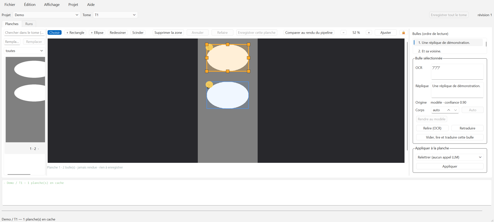

**Après, thème clair**

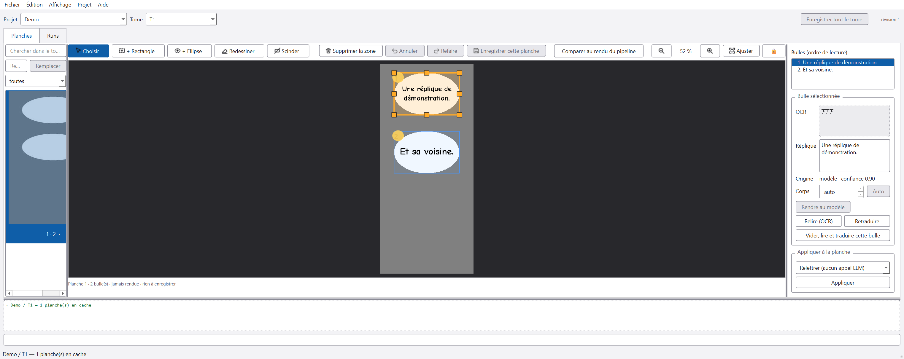

**Après, thème sombre** — le canevas est le même que dans le thème clair.

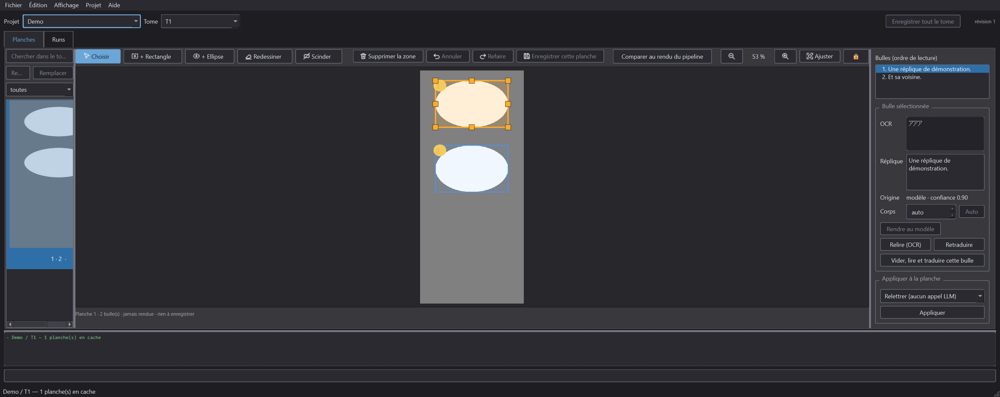

### 7.2 Onglet « Runs »

**Avant**

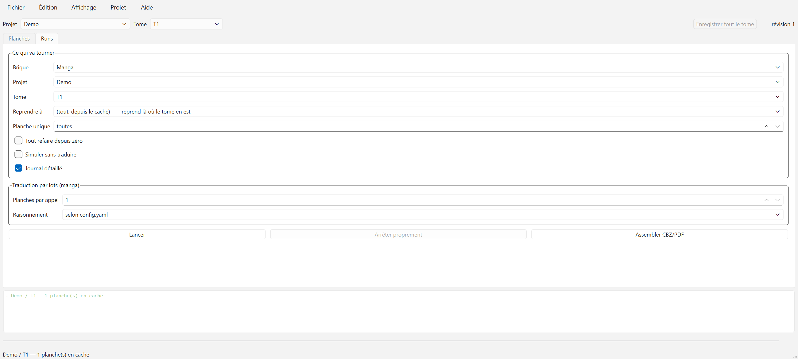

**Après, thème clair**

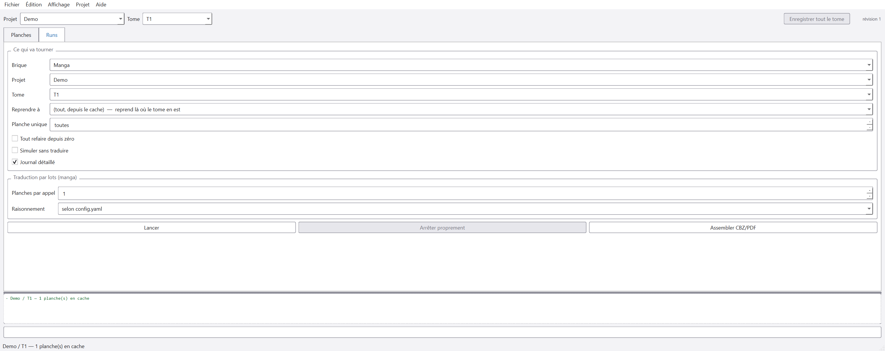

**Après, thème sombre**

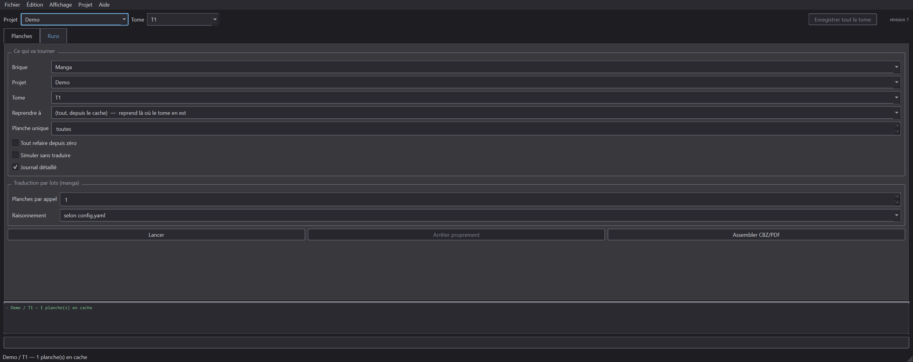

Ce qui se lit sur la capture « avant » et qui ne demande aucune mesure : la ligne
« Demo / T1 — 1 planche(s) en cache » du journal, en vert pâle sur blanc, à la limite du
visible. C'est le `succes` à 1,91:1.

### 7.3 Les cinq boîtes de dialogue

Pas d'« avant » : elles n'avaient pas de thème à comparer, seulement quatre `setStyleSheet`
inline. Ce que ces clichés démontrent est qu'elles **suivent** le thème sans qu'une ligne de
code aille les repeindre — c'est tout l'intérêt d'une feuille d'application.

| | Clair | Sombre |
|---|---|---|
| Nouveau projet | 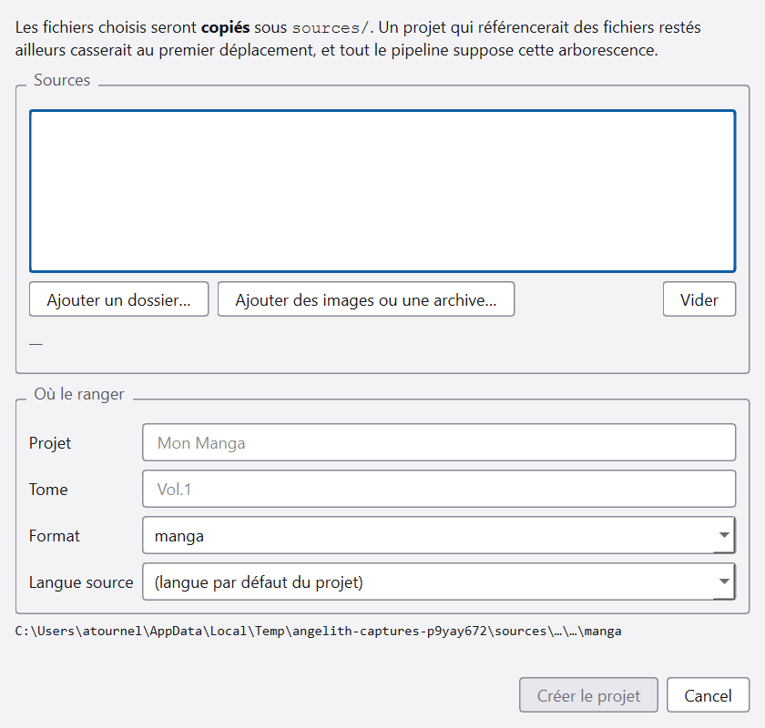 | 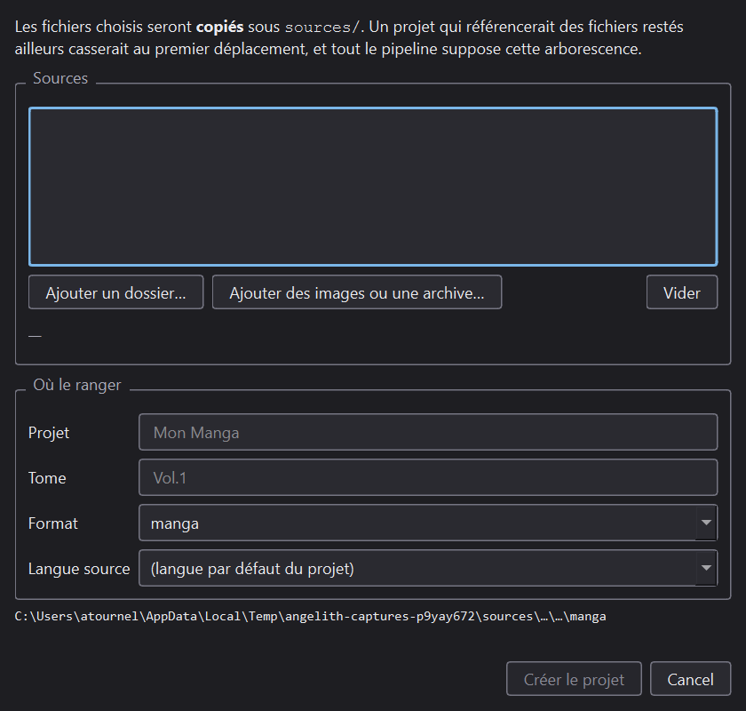 |
| Diagnostic | 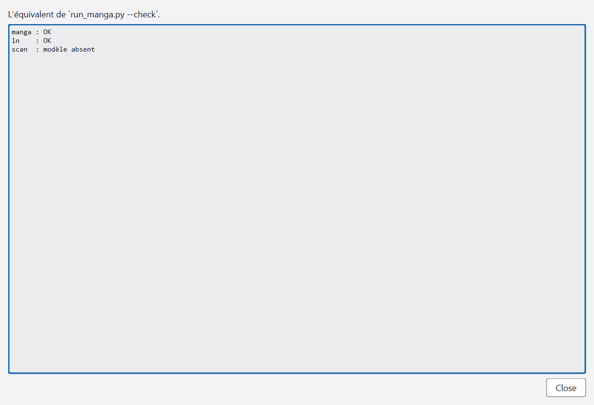 | 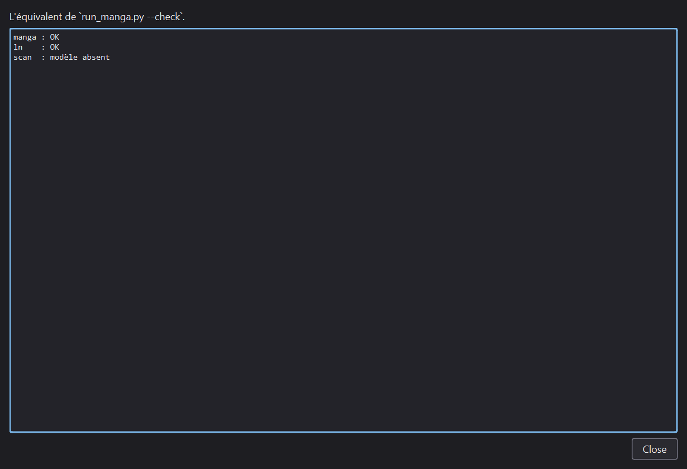 |
| Raccourcis clavier | 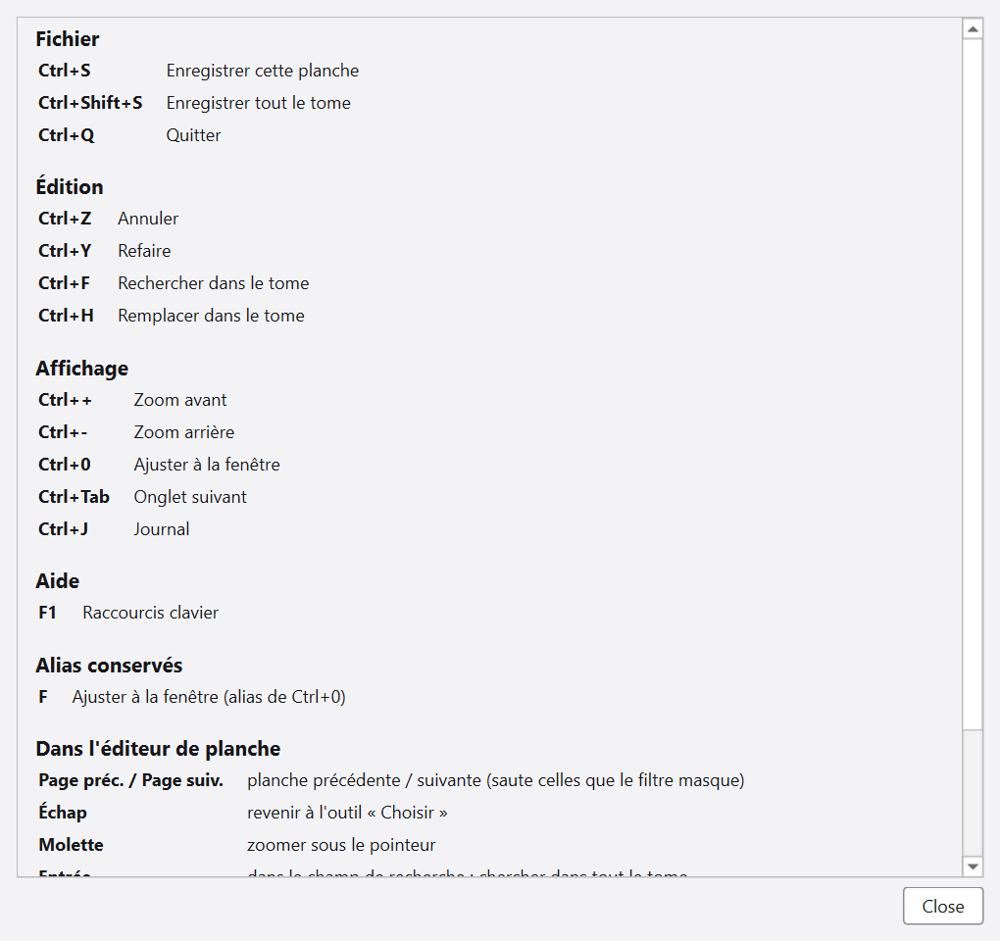 | 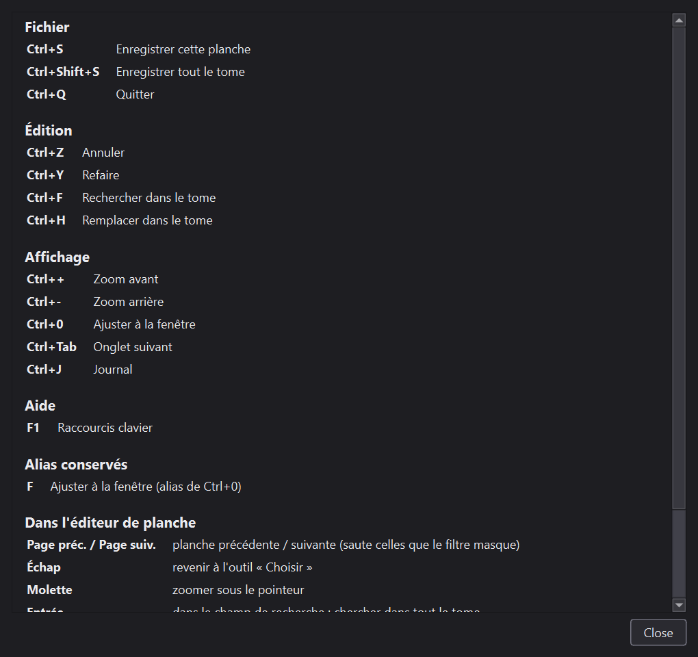 |
| Légende des symboles | 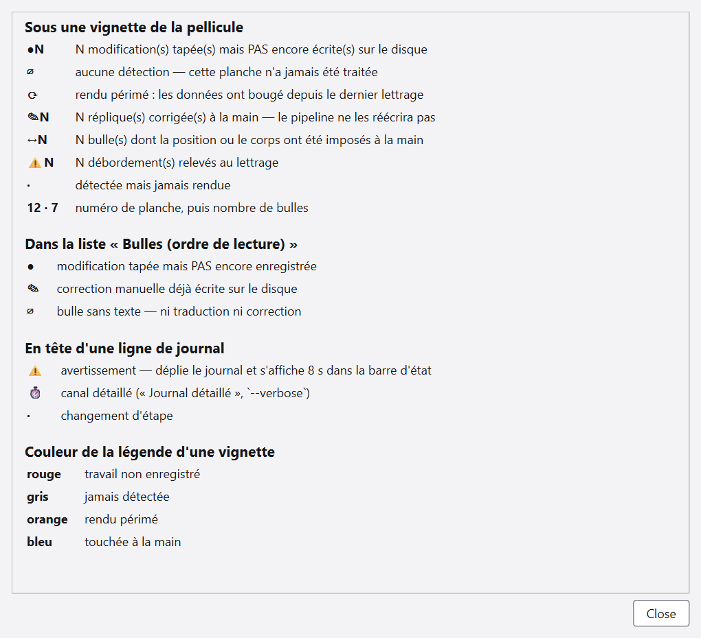 | 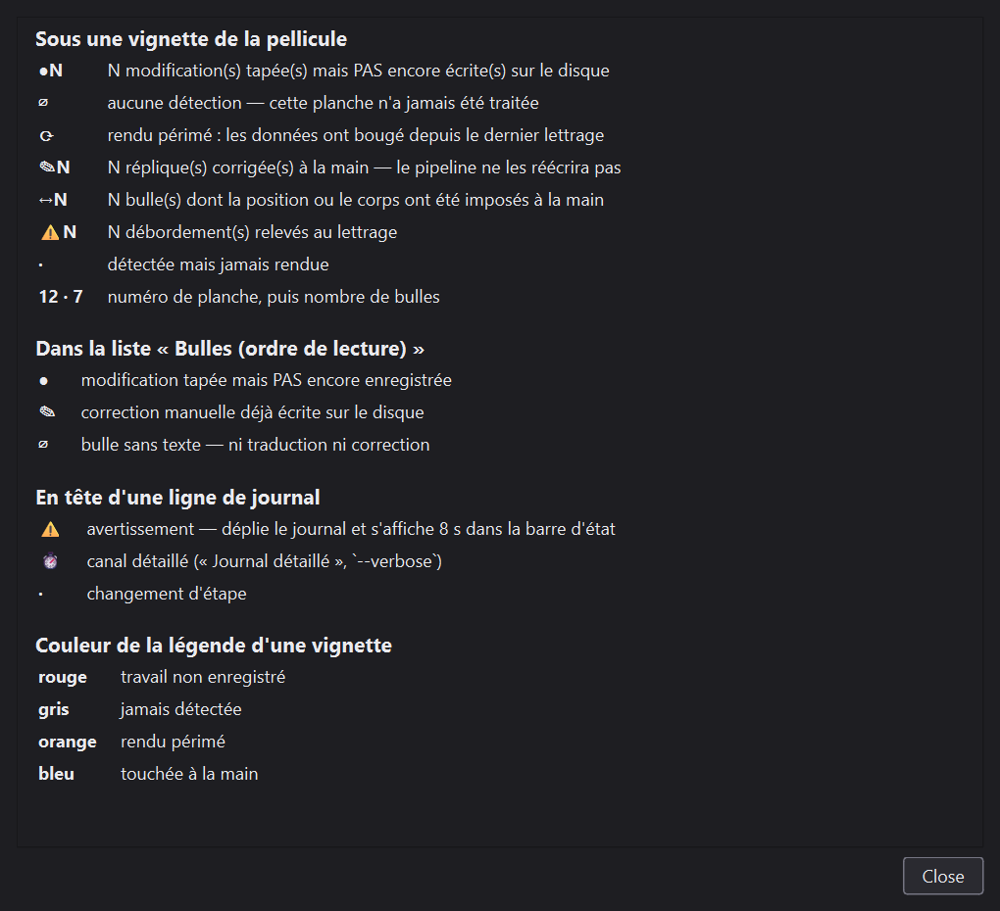 |
| Préférences | 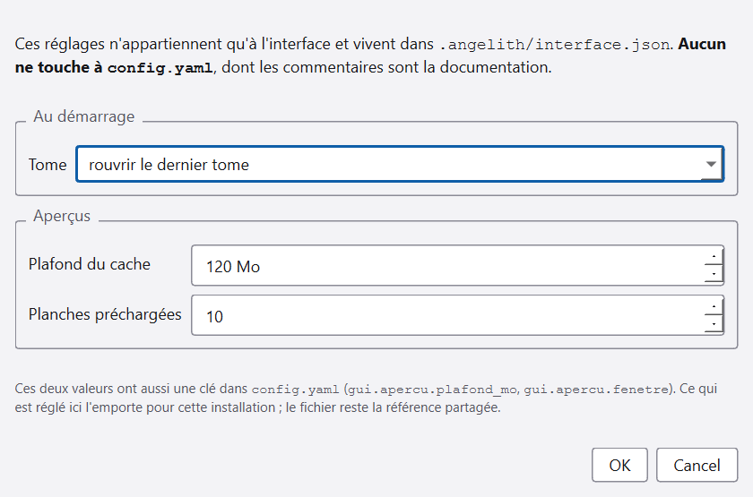 | 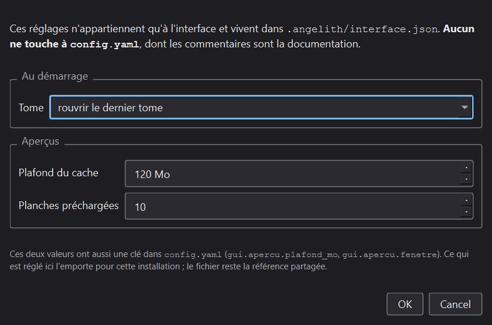 |

⚠ **Ce qu'on y voit et qui n'est pas beau : « Close » et « Cancel », en anglais.** Ce sont les
libellés par défaut de `QDialogButtonBox`, faute de `QTranslator` chargé. Défaut antérieur à ce
lot, signalé et non corrigé — cf. §8.1.

---

## 8. Les neuf critères, un par un

| # | Critère | Verdict |
|---|---|---|
| 1 | Plus une seule couleur littérale, `setStyleSheet` ou taille de police hors `gui/theme.py`, **vérifié par un test** | ✅ **tenu.** 26 → 0, 12 → 0, 6 → 0. `test_aucune_couleur_litterale_hors_theme`, `test_plus_un_seul_setstylesheet_dans_le_dossier`, `test_aucune_taille_de_police_en_pixels` |
| 2 | Les deux thèmes existent, le canevas reste sombre dans les deux, la bascule est dans le menu Affichage | ✅ **tenu.** Trois modes (`auto`/`clair`/`sombre`), sous-menu « Affichage → Thème », choix persisté. `test_le_canevas_ne_change_pas_avec_le_theme` |
| 3 | Le tableau de contraste est publié ; aucune paire sous sa cible | ✅ **tenu.** §4 — 35 paires × 2 thèmes = 70 mesures, 0 échec. Trois couleurs changées pour y arriver (§4.1) |
| 4 | Plus une seule taille en `px` ; l'échelle dérive de `QApplication.font()` | ✅ **tenu.** `test_l_echelle_appliquee_derive_de_la_police_de_l_application`, `test_l_echelle_reste_croissante` |
| 5 | Captures avant/après de chaque panneau, pour les deux thèmes | ✅ **tenu.** Les deux onglets **et les cinq boîtes de dialogue**, dans les trois états — quatorze clichés (§7). Réserve : le tome est **synthétique**, pas une œuvre du corpus (§6.1) |
| 6 | Nom accessible sur tout widget sans libellé lisible ; `setTabOrder` explicite par panneau ; focus visible | ✅ **tenu**, avec la réserve du §6.5 : aucun lecteur d'écran réel n'a été essayé |
| 7 | La zone se déplace et se retaille au clavier. Le dessin n'est **pas** couvert, et c'est écrit | ✅ **tenu, y compris la seconde phrase.** `test_le_clavier_ne_sait_pas_dessiner` verrouille le périmètre : il échouera le jour où quelqu'un croira le contraire |
| 8 | Les tests d'interface passent, et des tests neufs couvrent absence de littéral, monotonie de l'échelle, noms accessibles, contraste | ✅ **tenu.** **102 tests neufs**, dont **40 qui tournent sans PySide6**. Détail et dénominateurs au §8.2 |
| 9 | `ruff check .` et la boucle courte passent | ✅ **tenu** |

### 8.1 Le critère 5, et ce que les captures ont trouvé

Le plan dit « chaque panneau ». Les deux onglets sont couverts, **et les cinq boîtes de
dialogue le sont aussi** : création de projet, diagnostic, raccourcis clavier, légende des
symboles, préférences — quatorze clichés en tout. C'était initialement le point du lot où un
défaut d'apparence avait le plus de chances de survivre ; les regarder a coûté trente lignes
dans `tools/captures_gui.py`, et a rapporté deux trouvailles.

**Trouvaille 1 — la régression du thème non appliqué.** Cf. §6.4. Elle n'était visible que là :
soixante-dix mesures de contraste et cent vingt et un tests d'interface passaient sans la voir,
parce qu'ils interrogent la palette et les tokens, jamais le widget.

**Trouvaille 2 — les boutons standard de Qt sont en anglais.** « Close », « Cancel » : ce sont
les libellés par défaut de `QDialogButtonBox`, faute de `QTranslator` chargé. Le défaut est
**antérieur** à ce lot et n'en relève pas — il demande une infrastructure de traduction, pas un
token de couleur. Il est **signalé et non corrigé** : une correction non mesurée glissée dans un
lot mesuré est exactement ce que la règle des chiffres interdit.

### 8.2 Le critère 8, et son dénominateur

Tout mesuré le **2026-08-27**, sur le même poste, par `pytest --collect-only -q`. L'absence de
PySide6 est simulée par un `meta_path` qui le rend introuvable — c'est ce que fait le second job
de `ci.yml`, qui ne l'installe pas.

| Compte | Avant (`ad5f6f0`) | Après | Écart |
|---|---|---|---|
| Collecté **avec** PySide6 | 2 655 | **2 757** | **+102** |
| Collecté **sans** PySide6 | 2 515 | **2 555** | **+40** |
| Tests d'interface (la différence) | 140 | **202** | +62 |

**102 tests neufs, dont 40 qui ne demandent pas Qt** — les contrastes, l'échelle typographique,
le balayage des littéraux, la table des rôles et les trois modes du menu.

⚠ **Ces dénominateurs ne sont ni ceux de `ci.yml` ni celui du `00-CONTEXTE-AGENT.md`.** `ci.yml`
notait 2 007 / 1 879 au 2026-08-25 ; le contexte agent, 2 262 pour la même date ; le lot 18,
2 644 / 2 504 au 2026-08-27 — soit 11 de plus que ce qui est mesuré ici pour le même commit,
l'écart venant du lot 2.9.1 (Sonar) livré entre-temps. Un compte de tests n'a de sens qu'avec
sa date, sa machine et son commit ; le seul chiffre qui vaille ici est l'**écart avant/après
mesuré le même jour**.

---

## 9. Ce que le lot n'a pas fait, délibérément

- **Aucune action nouvelle, aucun menu nouveau** au-delà du sous-menu « Thème » — qui est la
  bascule que le critère 2 exige.
- **Aucune refonte de la disposition.** Trois colonnes, deux onglets : inchangé.
- **Aucune animation, aucune transition.**
- **Aucun changement au pipeline.** Aucun fichier de `manga/`, `pipeline/` ou `core/` n'est
  touché, `FORMAT_VERSION` est intact, et aucun cache existant n'est invalidé.
- **Aucune maquette.** Le plan la déclarait facultative et non livrable ; elle n'a pas été
  faite, et le tableau de contraste a servi de référence de relecture à sa place.

---

## 10. Ce que la documentation dit maintenant

| Fichier | Ce qui y est ajouté |
|---|---|
| `docs/README.fr.md` §12 | la bascule de thème, le canevas qui reste sombre, l'alternative clavier **et son périmètre** |
| `docs/COMMANDES.fr.md` | les flèches, `Ctrl`+flèches, `1`–`5`, le thème, et « tracer reste un geste de souris » |
| `CHANGELOG.md` | l'entrée 2.10.0, qui nomme le document que voici |

⚠ **Le mémo des raccourcis contenait déjà une dérive** que ce lot n'a pas corrigée : il annonce
`F` pour « ajuster », alors que le lot 18 a fait de `Ctrl+0` le raccourci déclaré et de `F` un
simple alias. Elle est signalée ici plutôt que réparée en passant — ce n'est pas le sujet de ce
lot, et une correction non mesurée glissée dans un lot mesuré est exactement ce que la règle
des chiffres interdit.

---

## 11. Reproduire les mesures

```powershell
# Le tableau de contraste, tel qu'il est publié au §4
python -c "from gui import theme; [print(l) for l in theme.tableau_contraste(theme.CLAIRE)]"

# Les garde-fous du lot. Le PREMIER fichier n'importe pas PySide6 — c'est le sujet.
python -m pytest tests/test_gui_theme.py -q            # 40, sans Qt
python -m pytest tests/test_gui_theme_qt.py -q         # 35, avec

# Le compte de tests sans PySide6, tel que le second job de la CI le voit. Le plugin rend
# PySide6 introuvable ; il vit hors du dépôt et ne s'y installe pas.
python -m pytest --collect-only -q -p <plugin_qui_bloque_PySide6>

# Les captures
python tools/captures_gui.py docs/img/gui-apres --theme clair --theme sombre

# Le repli, le temps d'une mise au point — PAS un réglage livré
$env:ANGELITH_STYLE_NATIF = "1"; python gui.py
```
